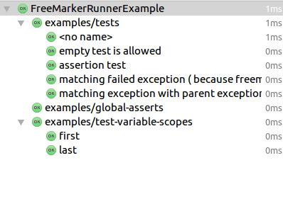

# JUnit4 FreeMarker Test Framework
> a test framework for freemarker, you can use this project for learning freemarker step by step.

## Test Syntax

```ftl
<@test name="test some feature">
  <#assign foo="bar">
  
  <@assert expected='bar' actual=foo/>
  <@assert expected=foo=='bar'/>
  <@assert expected=foo>bar</@assert>
</@test>

<@test name="matching test will failed with exception" expected="java.lang.Exception">${invalid_expression}</@test>
```

## Get Started

Write a test make it run as **ScriptRunner** and defined a method annotated with **@Scanner** annotation return an instance of **ScriptScanner**. 

```java
@RunWith(ScriptRunner.class)
public class FreeMarkerRunnerExample {

  public static @Scanner ScriptScanner scanner() {
    return new FileSystemScriptScanner(file("src/test/resources"),
        allOf(not(startsWith("_")), endsWith(".ftl")));
  }
}
```

## Test Result

